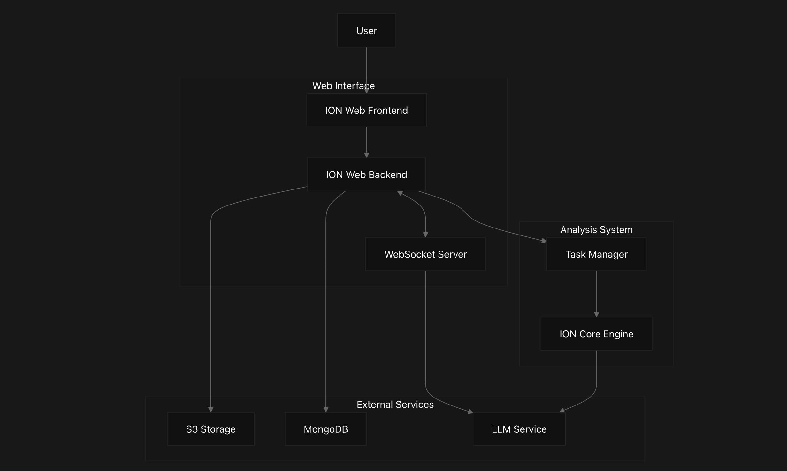
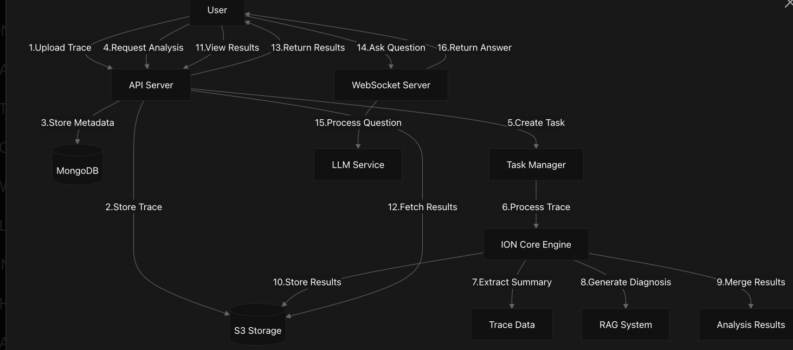
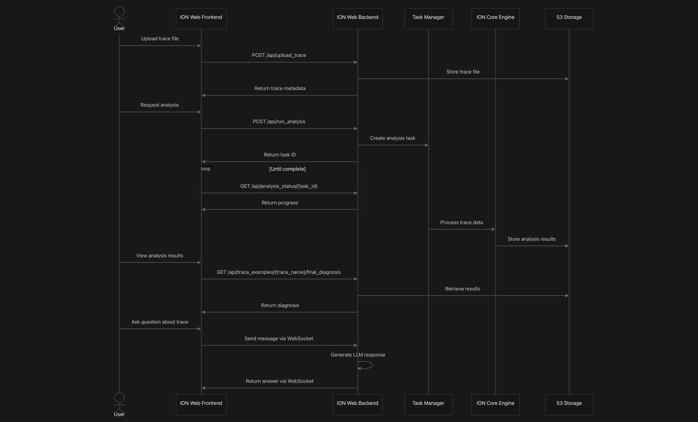
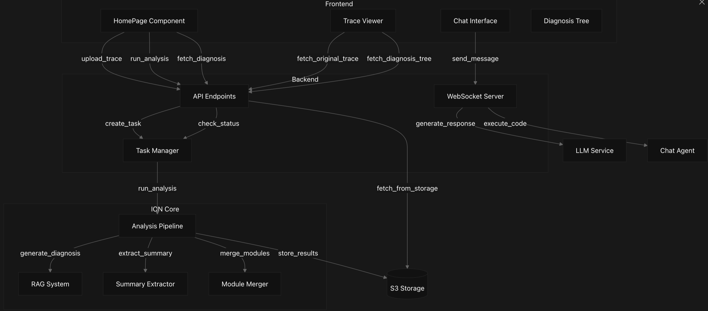

# IONavigator Documentation

Welcome to the IONavigator documentation site.

---

## Overview

IONavigator (ION) is an AI-powered intelligent diagnostic system purpose-built to address the growing challenges in understanding and resolving I/O performance issues within high-performance computing (HPC) environments. As modern scientific workloads generate increasingly complex and large-scale I/O patterns, traditional manual methods for analyzing performance logs—especially Darshan logs—become time-consuming, expert-dependent, and prone to bottlenecks.

IONavigator solves this problem by using cutting-edge large language models (LLMs) to automatically interpret Darshan trace files and produce detailed, human-readable diagnostics that highlight performance bottlenecks, anomalies, and optimization opportunities. These models are enhanced with domain-specific knowledge and integrated into a multi-stage analysis pipeline that mimics how expert I/O analysts would work.

The system includes several key components such as a modular pre-processor, a Retrieval-Augmented Generation (RAG) engine for incorporating external domain knowledge, and a tree-based diagnosis merger to unify insights from different analysis modules. The final output is a refined, contextual diagnosis report that helps scientists and engineers make informed decisions to improve I/O performance.

In addition to backend intelligence, IONavigator also offers a user-friendly web interface, enabling users to upload traces, view diagnostic results, and interact with the system through a natural language chat agent. This makes IONavigator not only powerful, but also accessible to non-experts who may not have deep HPC I/O backgrounds.

IONavigator represents a significant step forward in democratizing I/O performance analysis for large-scale computing, streamlining workflows, and accelerating scientific discovery.

---

## Key Feature

IONavigator addresses the challenge of analyzing complex I/O traces by combining traditional analysis techniques with advanced LLM capabilities to:

- Analyze Darshan trace logs to identify I/O performance bottlenecks  
- Generate detailed, contextualized diagnoses of I/O issues  
- Provide an interactive interface for exploring trace data and diagnoses  
- Support natural language querying of trace data through a chat interface

---

## System Architecture

  

---
## Main Components

ION Web Frontend

React-based web application that provides the user interface for:

- Uploading and managing trace files
- Viewing analysis results and diagnoses
- Interacting with the system through a chat interface
- Exploring trace data visualizations

ION Web Backend

Flask-based API server that provides:

- REST API endpoints for trace management
- WebSocket server for real-time chat communication
- Task management for asynchronous trace analysis
- Integration with storage (S3) and database (MongoDB) services
---
## ION Core Engine
The analysis engine responsible for:

- Extracting summary information from trace data
- Generating diagnoses using Retrieval-Augmented Generation (RAG)
- Merging analysis results within and across modules
- Producing final, refined diagnosis outputs
---
## Data Flow

  

---
## Analysis Process

### 1. Summary Extraction

IONavigator extracts **module-level summaries** from the trace, including:
- POSIX operations (read/write counts, sizes, timing)
- STDIO activities (file handles, operation sizes)
- LUSTRE file system settings (stripe counts, server usage)
- Heatmap data showing I/O patterns over time

### 2. RAG-Based Diagnosis

Using **Retrieval-Augmented Generation (RAG)**, IONavigator:
- Queries a knowledge base of research papers and best practices
- Retrieves the most relevant content for the detected issues
- Generates **diagnostic explanations** with references and suggested actions

### 3. Pairwise Merging of Diagnoses

IONavigator uses a **tree-based pairwise merge** strategy:
- **Intra-Module Merging**: Combines similar issues within the same module (e.g., multiple POSIX findings)
- **Inter-Module Merging**: Combines findings across all modules into a **comprehensive system diagnosis**

### 4. Final Diagnosis: 
Produces a comprehensive diagnosis document

IONavigator produces:
- **Markdown** (`final_diagnosis.md`) for structured documentation
- **HTML** (`final_diagnosis.html`) for easy web-based viewing

You can find these in the `ION_Output` directory after execution.

---

## Component Interaction
- The typical Component interaction with IONavigator follows this sequence:

  

---

## User Interaction 

- The typical user interaction with IONavigator follows this sequence:

  

---

## Technologies Used

IONavigator leverages several technologies:

- Frontend: React.js with TypeScript
- Backend: Flask (Python), Flask-SocketIO
- Storage: S3-compatible object storage
- Database: MongoDB
- AI/ML: Large language models (OpenAI, Anthropic)
- Analysis: Retrieval-Augmented Generation (RAG)